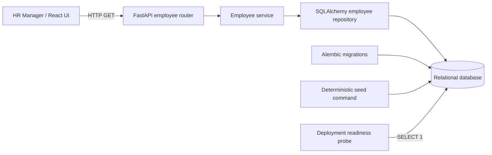

# Current System Design

This document distinguishes the verified browsing foundation from the target architecture for
Incubyte's now-confirmed MVP. The target sections are plans, not claims about current production.

## System and Request Flow

Employee browsing follows a small modular-monolith flow:

1. React owns the active search/filter/page state and requests only the current page.
2. FastAPI validates query parameters and owns the HTTP response contract.
3. The employee service normalizes optional search and filter inputs and calculates page metadata.
4. The repository builds the filtered count and bounded employee query.
5. SQLAlchemy executes both queries against relational persistence.

The browser uses relative `/api` URLs by default. Vite proxies those requests to FastAPI during
local development, and the same URLs support a production reverse proxy under one origin. A
split-origin build can embed the backend origin through `VITE_API_BASE_URL`; the backend then
allows only explicitly configured `CORS_ALLOWED_ORIGINS`. In-flight requests are cancelled when
the query changes, and controls are disabled until the replacement page is resolved. API salary
strings are grouped for display without conversion to JavaScript numbers.

## Backend Boundaries

- `api`: HTTP routing, validation, dependencies, and response schemas.
- `application`: browsing behavior and pagination metadata.
- `persistence`: SQLAlchemy model, session lifecycle, and employee queries.
- `seed`: deterministic assessment-data generation and repeat-run safety.
- `alembic`: versioned relational schema changes.

These are concrete modules rather than interface-heavy layers. New abstractions should be added
only when another behavior or persistence implementation creates a demonstrated need.

## Employee Data

The current employee record contains employee code, name, email, country, department, job title,
salary amount, currency, and active status. It is deliberately a browsing foundation, not a final
compensation model.

Salary is represented as Python `Decimal` and database `NUMERIC(14,2)`. Binary floating point is
not used for storage, seeding, filtering, or API serialization.

Database integrity currently includes:

- primary key on `id`;
- unique indexed employee code and email;
- positive salary check;
- three-character currency check;
- indexes on name, country, and department;
- an index on active status;
- a combined country/department index for the supported filter combination.

Requiring salary amount to be greater than zero is a pragmatic current domain assumption, not an
Incubyte-specified business rule. It protects the initial dataset from clearly unusable salary
values and can be revisited if later requirements establish valid zero-value compensation cases.
It does not warrant another clarification request unless it becomes material to later scope.

## Browsing Queries

`GET /api/employees` uses server-side pagination with a default page size of 25 and a maximum of
100. The repository runs one filtered count query and one bounded data query. Search is
case-insensitive across employee code, name, and email; SQL wildcard characters are escaped and
treated literally. Country, department, and active/inactive/all status filters are applied in SQL.
Sorting is allowlisted to employee code, name, country, department, and job title; ascending and
descending non-code sorts append employee code ascending as a deterministic tie-breaker. The
browser never needs the full 10,000-record dataset.

## Seed Strategy

The seed command deterministically generates employee codes `EMP00001` through `EMP10000` and
stable associated data. An empty database receives exactly 10,000 records. A repeat run is a no-op
when all deterministic employee codes are present, regardless of additional application-created
employees. A partial deterministic code set causes an explicit error. Seeding never rewrites
salary or active-state changes made through later application workflows.

## Database Strategy

SQLite keeps local setup and tests lightweight. The connection comes from `DATABASE_URL`, while
SQLAlchemy models and Alembic migrations provide a path to a PostgreSQL-compatible deployment
database. Common provider forms (`postgres://` and `postgresql://`) are normalized to SQLAlchemy's
installed Psycopg 3 driver form. Both the application and Alembic use the same normalization.

Migrations and deterministic seeding are explicit operational commands; neither runs during API
startup. This prevents web-process restarts or horizontal scaling from mutating production data.
`/health` reports process liveness, while `/ready` executes a minimal database query and returns
`503` with a generic response when persistence is unavailable.

## Deployment Topology

The selected topology is one Vercel Services project and one Neon Postgres database. Vercel builds
`frontend/` as a Vite service at `/` and packages the existing FastAPI application as a separate
service through the thin `api/index.py` entrypoint. Ordered public service rewrites send `/api/*`,
`/health`, and `/ready` to FastAPI and all other paths to Vite. Browser requests therefore remain
same-origin and require neither `VITE_API_BASE_URL` nor CORS configuration.

Vercel resolves the root `pyproject.toml` with uv, which maps the declared
`salary-management-api` dependency to the existing `./backend` project rather than duplicating its
runtime dependency list. Neon supplies a pooled TLS connection string for
`DATABASE_URL`; SQLAlchemy validates reused connections with `pool_pre-ping`. Alembic migrations
and optional deterministic seeding use a direct Neon connection from a trusted operator shell and
remain outside Vercel build and function startup.

The deployed topology is verified at https://incubyte-salary-management-eight.vercel.app. Vite
owns `/` and frontend paths, while FastAPI owns `/api/*`, `/health`, and `/ready`. Production reads
10,000 seeded employees from Neon, and the frontend uses relative API URLs on the shared origin.
As with any serverless deployment, the first request after inactivity may experience a cold start;
the readiness probe distinguishes application availability from database connectivity.

## Confirmed MVP Architecture Plan

### Data Model and Migration

- Keep `employees.salary_amount` and `employees.currency` as the native-currency source of truth.
- `employees.is_active` is implemented as non-null and indexed; migration `20260831_02` backfills
  existing rows to `true`. The current API supports active/inactive/all filtering. The later
  deactivate workflow must update this flag and never physically delete an employee.
- Preserve employee-code and email uniqueness across inactive records.
- `exchange_rates(currency_code, rate_to_usd, effective_date)` is implemented with
  `NUMERIC(20,10)` and includes USD at `1`. The deterministic seed owns the fixed dated rates; no
  network call or runtime refresh occurs.
- Migration `20260831_03` creates the exchange-rate table. The seed verifies the complete employee
  and rate sets independently. Production migration and seeding remain explicit operator actions.

USD is an engineering choice, not Incubyte guidance: Incubyte required a common reporting currency
and gave USD or INR only as examples. Country is the MVP regional comparison grain, avoiding a
second geographic taxonomy until one is required.

`currency_code` is the exchange-rate primary key, so exactly one seeded rate exists per supported
currency. `rate_to_usd` means `1` unit of that currency equals `rate_to_usd` USD. Rates use
`NUMERIC(20,10)`/`Decimal`, never floating point. Conversion and aggregation retain full available
decimal precision; only final API display/reporting amounts are rounded to two USD decimal places.
The application normalization service rejects non-Decimal salary input and raises
`exchange_rate_unavailable` when a currency has no seeded rate; it never returns an unconverted
amount.

### API and Query Model

- `GET /api/employees` supports allowlisted `sort_by`, `sort_direction`, and `status` parameters;
  sorting, filtering, and pagination remain one stable server-side query.
- `POST /api/employees` creates active employees through the service/repository transaction. The
  database remains the concurrency-safe uniqueness guard, while structured `409` responses identify
  code/email conflicts. `GET /api/metadata/currencies` exposes codes only for the create selector.
- `PATCH /api/employees/{employee_code}/salary` updates only the Decimal salary amount for active
  employees; inactive employees return `409`. `POST /api/employees/{employee_code}/deactivate` is
  idempotent, sets `is_active=false`, and never issues SQL `DELETE`. Both return structured `404`
  for unknown codes.
- Keep directory responses sufficient for viewing the complete MVP record. A separate detail
  endpoint is deferred because it would duplicate the same fields without a distinct workflow.
- `GET /api/analytics/payroll` returns total normalized payroll, department/country breakdowns and
  extrema; optional country, department, and job-title filters compose in the repository query.
  `GET /api/analytics/roles/{job_title}` returns average and P50 by country. Both exclude inactive
  employees unless `include_inactive=true` is supplied.
- Country filters are trimmed and uppercased. Department filters are trimmed and use the directory's
  case-sensitive exact matching; job-title filters and role paths are trimmed, case-insensitive exact
  matches. Fuzzy role grouping is outside the MVP.

Allowed sort fields are `employee_code`, `name`, `country`, `department`, and `job_title`, in
ascending or descending order. Native salary is deliberately excluded because amounts in different
currencies are not directly comparable. Every non-code sort appends `employee_code ASC` as a unique
tie-breaker, keeping page boundaries stable; code sorting is already unique.

Create validates positive salary and requires a currency present in `exchange_rates`. Employee code
and email conflicts, including conflicts with inactive rows, return HTTP `409`; validation failures
return `422`. Salary update accepts only a new positive `salary_amount`, retains the employee's
native currency, and creates no history row. Repeated deactivation returns the same inactive result
without another state transition. Reactivation is not an Incubyte-requested workflow and is outside
P0 rather than being inferred.

Normalization multiplies each native salary by its seeded `rate_to_usd` and rounds only at the API
presentation boundary. The repository loads one filtered employee/FX projection; the application
aggregates and calculates P50 with exact Decimal arithmetic. This portable approach avoids divergent
percentile behavior between SQLite tests and PostgreSQL production at the approximately 10,000-row
MVP scale.

Payroll breakdown entries include normalized total payroll, average salary, and median/P50 salary.
Explicit `highest_payroll_*` arrays answer spend questions, while `highest_median_*` and
`lowest_median_*` arrays use P50 as the less-outlier-sensitive pay-distribution comparison. All ties
are returned in deterministic name order, and extrema are compared at full precision before display
rounding; no separate endpoint is needed. P50
for cross-country role comparison is calculated over each employee's normalized USD value. With no
matching employees, analytics return HTTP `200`, a zero total, empty breakdown arrays, and empty
role statistics. A missing rate aborts the calculation—no partial or unconverted total is returned—
with a structured `503 exchange_rate_unavailable` response.

### Frontend Workflows

- The directory implements sortable headings, active/inactive filtering, and an accessible create
  dialog backed by server currency metadata. Successful creation refetches the current server page.
- Active rows expose focused salary-edit and confirmation-based deactivate dialogs. Currency is
  read-only during salary edits, deactivation explains record retention, and both workflows refetch
  the current server query after success. Inactive rows expose neither action.
- Treat the existing complete directory row as the P0 record view; do not add a detail route yet.
- Add a dashboard with top-level USD KPIs, department/country breakdown charts or tables, role P50
  and average comparisons, extrema, and useful filters. Clearly label native versus normalized USD.
- Keep relative `/api` requests and the current same-origin deployment; authentication UI is absent.

### Implementation Sequence

1. Migration, model, exchange-rate seed, and constraint tests.
2. Active-aware repository queries, server sorting, create/update/deactivate services, and APIs.
3. Normalized analytics queries and API contracts, including P50 and inactive-default behavior.
4. Directory management workflows, then the structured analytics dashboard.
5. Acceptance tests, fresh migration/seed verification, and production-safe rollout checks.

Authentication, SSO/RBAC, reactivation, history, compensation components, bulk Excel import, live
FX, and required natural-language querying are deliberately excluded. Auth becomes a production
prerequisite before exposing employee-management writes beyond the assumed authorized internal
environment.
