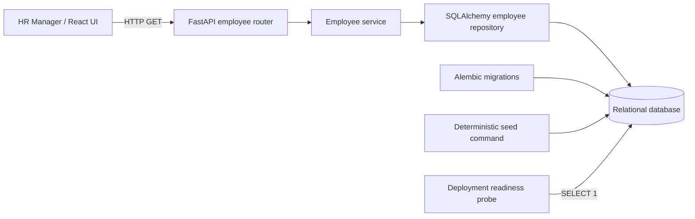

# Current System Design

This document describes the architecture implemented so far. It intentionally excludes
features that depend on Incubyte's pending clarifications.

## System and Request Flow

Employee browsing follows a small modular-monolith flow:

1. React owns the active search/filter/page state and requests only the current page.
2. FastAPI validates query parameters and owns the HTTP response contract.
3. The employee service normalizes optional search and filter inputs and calculates page metadata.
4. The repository builds the filtered count and bounded employee query.
5. SQLAlchemy executes both queries against relational persistence.

The browser uses relative `/api` URLs by default. Vite proxies those requests to FastAPI during
local development, and the same URLs support a production reverse proxy under one origin. A
split-origin build can embed the backend origin through `VITE_API_BASE_URL`; the backend then
allows only explicitly configured `CORS_ALLOWED_ORIGINS`. In-flight requests are cancelled when
the query changes, and controls are disabled until the replacement page is resolved. API salary
strings are grouped for display without conversion to JavaScript numbers.

## Backend Boundaries

- `api`: HTTP routing, validation, dependencies, and response schemas.
- `application`: browsing behavior and pagination metadata.
- `persistence`: SQLAlchemy model, session lifecycle, and employee queries.
- `seed`: deterministic assessment-data generation and repeat-run safety.
- `alembic`: versioned relational schema changes.

These are concrete modules rather than interface-heavy layers. New abstractions should be added
only when another behavior or persistence implementation creates a demonstrated need.

## Employee Data

The current employee record contains employee code, name, email, country, department, job title,
salary amount, and currency. It is deliberately a browsing foundation, not a final compensation
model.

Salary is represented as Python `Decimal` and database `NUMERIC(14,2)`. Binary floating point is
not used for storage, seeding, filtering, or API serialization.

Database integrity currently includes:

- primary key on `id`;
- unique indexed employee code and email;
- positive salary check;
- three-character currency check;
- indexes on name, country, and department;
- a combined country/department index for the supported filter combination.

Requiring salary amount to be greater than zero is a pragmatic current domain assumption, not an
Incubyte-specified business rule. It protects the initial dataset from clearly unusable salary
values and can be revisited if later requirements establish valid zero-value compensation cases.
It does not warrant another clarification request unless it becomes material to later scope.

## Browsing Queries

`GET /api/employees` uses server-side pagination with a default page size of 25 and a maximum of
100. The repository runs one filtered count query and one bounded, employee-code-ordered data
query. Search is case-insensitive across employee code, name, and email; SQL wildcard characters
are escaped and treated literally. Country and department filters are applied in SQL. The browser
never needs the full 10,000-record dataset.

## Seed Strategy

The seed command deterministically generates employee codes `EMP00001` through `EMP10000` and
stable associated data. An empty database receives exactly 10,000 records. A repeat run is a
no-op only when all deterministic employee codes are present. Partial or unrelated employee data
causes an explicit error instead of being mixed silently with generated data.

## Database Strategy

SQLite keeps local setup and tests lightweight. The connection comes from `DATABASE_URL`, while
SQLAlchemy models and Alembic migrations provide a path to a PostgreSQL-compatible deployment
database. Common provider forms (`postgres://` and `postgresql://`) are normalized to SQLAlchemy's
installed Psycopg 3 driver form. Both the application and Alembic use the same normalization.

Migrations and deterministic seeding are explicit operational commands; neither runs during API
startup. This prevents web-process restarts or horizontal scaling from mutating production data.
`/health` reports process liveness, while `/ready` executes a minimal database query and returns
`503` with a generic response when persistence is unavailable.

## Deployment Topology

The selected topology is one Vercel project and one Neon Postgres database. Vercel serves the
compiled React assets at the project domain and packages the existing FastAPI application through
a thin `api/index.py` entrypoint. `/api/*` reaches the Python function directly; Vercel rewrites
`/health` and `/ready` to deployment aliases on the same function. Browser requests therefore
remain same-origin and require neither `VITE_API_BASE_URL` nor CORS configuration.

Vercel resolves the root `pyproject.toml` with uv, which maps the declared
`salary-management-api` dependency to the existing `./backend` project rather than duplicating its
runtime dependency list. Neon supplies a pooled TLS connection string for
`DATABASE_URL`; SQLAlchemy validates reused connections with `pool_pre-ping`. Alembic migrations
and optional deterministic seeding use a direct Neon connection from a trusted operator shell and
remain outside Vercel build and function startup.

## Pending Product Decisions

The following remain intentionally unresolved pending Incubyte's answers:

- current salary versus salary history;
- compensation components and bulk import/export;
- local-currency reporting versus normalization and exchange rates;
- examples and form of organizational compensation questions, including any natural-language UI;
- authentication and authorization expectations.

The current slice does not implement or silently decide any of these behaviors.
